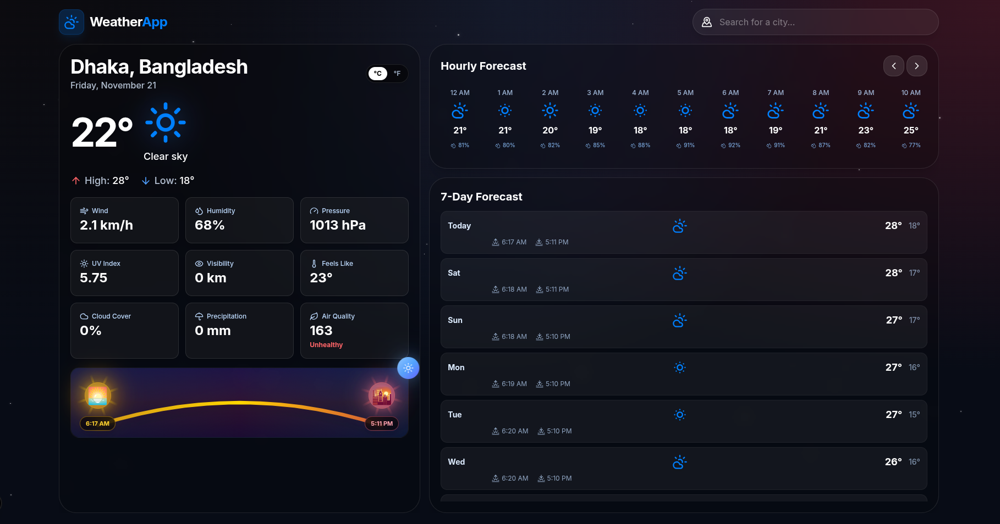

# Weather App 🌤️

**A beautiful, modern web application that displays real‑time weather information** built with **Next.js** and **TypeScript**. This project showcases a sleek UI with animated starry backgrounds, responsive design, and easy integration with any weather API.

⚡ **This entire project, including all source code, was generated entirely by Antigravity, an AI‑powered coding assistant.**

---

## Table of Contents

- [Overview](#overview)
- [Features](#features)
- [Demo](#demo)
- [Getting Started](#getting-started)
- [Installation](#installation)
- [Running the Development Server](#running-the-development-server)
- [Building for Production](#building-for-production)
- [Contributing](#contributing)
- [License](#license)
- [Acknowledgements](#acknowledgements)

---

## Overview

This repository is a **starter template** for developers who want to quickly spin up a weather‑forecast web app. It includes:

- A clean, component‑based UI built with **React** and **Next.js** App Router.
- Dynamic background effects (blinking stars) that stay visible behind content.
- Type‑safe code with **TypeScript**.
- Ready‑to‑use styling with modern CSS techniques (CSS variables, gradients, glass‑morphism).

---

## Features

- **Current weather** display (temperature, condition, location).
- **5‑day forecast** with icons and temperature ranges.
- **Responsive layout** – works on mobile, tablet, and desktop.
- **Animated starry background** that remains visible through transparent UI cards.
- **Easy API integration** – replace the placeholder fetch with any weather service (e.g., OpenWeatherMap, WeatherAPI).

---

## Demo



The screenshot above shows the Weather App UI after loading, with the animated starry background visible.

---

## Getting Started

### Prerequisites

- **Node.js** (v18 or later) – you can download it from [nodejs.org](https://nodejs.org/).
- **npm**, **yarn**, **pnpm**, or **bun** – any package manager you prefer.

---

## Installation

```bash
# Clone the repository
git clone https://github.com/your-username/weather-app.git
cd weather-app

# Install dependencies (choose your package manager)
npm install   # or yarn install, pnpm install, bun install
```

---

## Running the Development Server

```bash
# Start the dev server
npm run dev   # or yarn dev, pnpm dev, bun dev
```

Open [http://localhost:3000](http://localhost:3000) in your browser. The page will automatically reload as you edit files.

---

## Building for Production

```bash
npm run build   # or yarn build, pnpm build, bun build
npm start       # or yarn start, pnpm start, bun start
```

The optimized production build will be placed in the `.next` directory.

---

## Contributing

Contributions are welcome! Feel free to open issues or submit pull requests. Please follow the standard GitHub flow:

1. Fork the repo.
2. Create a feature branch.
3. Commit your changes with clear messages.
4. Open a pull request.

---

## License

This project is licensed under the **MIT License** – see the `LICENSE` file for details.

---

## Acknowledgements

Special thanks to the open‑source community for the tools and libraries that make this project possible.

---

_Happy coding!_
V
